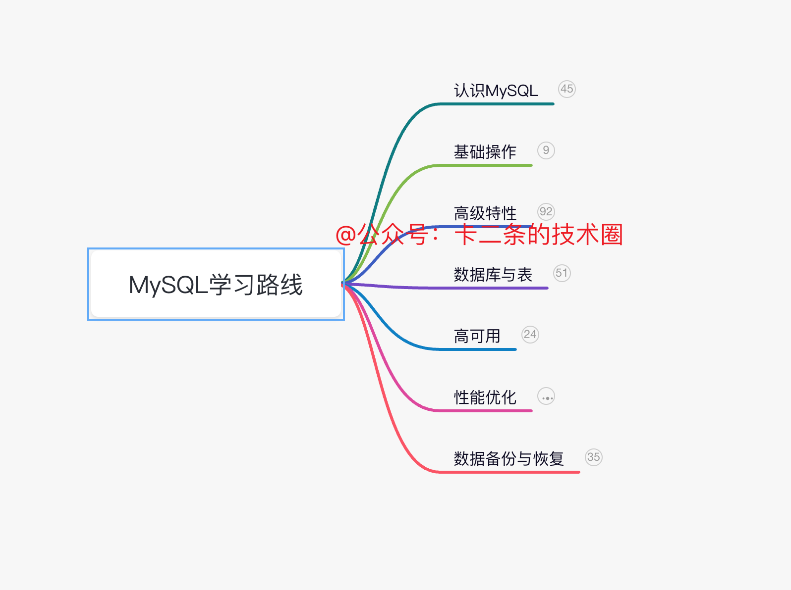
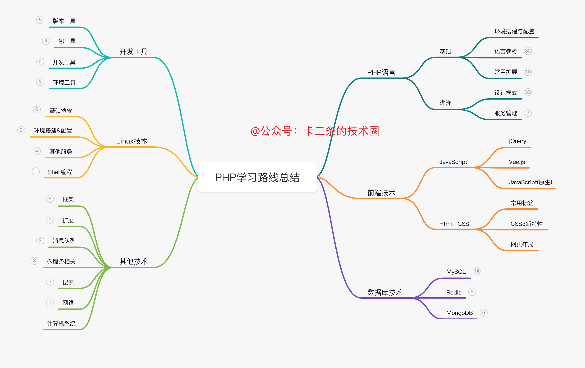
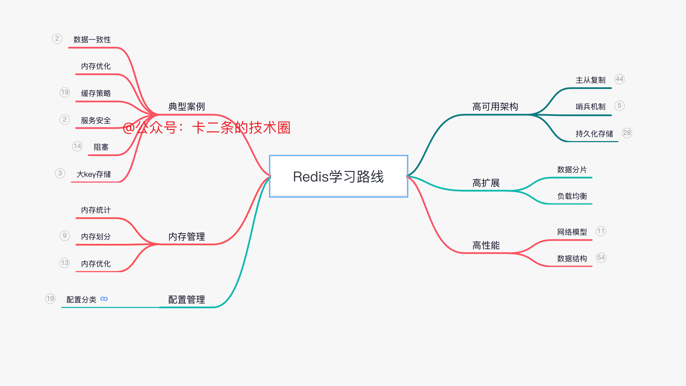
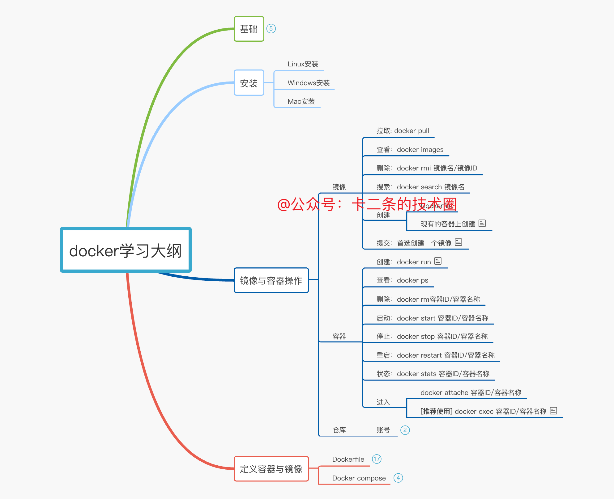

> 专注于PHP、MySQL、Linux和前端开发，感兴趣的感谢点个关注哟！！！文章整理在[GitHub](https://github.com/bruceqiq/code_study),[Gitee](https://gitee.com/bruce_qiq/code_study)主要包含的技术有PHP、Redis、MySQL、JavaScript、HTML&CSS、Linux、Java、Golang、Linux和工具资源等相关理论知识、面试题和实战内容。

### 仓库说明

本仓库为个人编程学习总结，涵盖了服务端、客户端等编程语言技术知识。是对编程工作中的技术学习、经验总结等。转载请标明出处，只可以在本仓库进行查看。部分文章会涉及到一些资源分享，可以关注个人公众号“菜鸟成长学习笔记”进行获取。可以通过下面扫码方法进行获取。
.png)
### 仓库内容

仓库主要包含的技术有PHP、Redis、MySQL、JavaScript、HTML&CSS、Linux、Java、Golang、Linux和工具资源等相关理论知识、面试题和实战内容。

### 仓库地址

由于GitHub时常遇到访问很慢的情况，因此仓库内容也会自动同步到Gitee，访问慢的情况，推荐使用Gitee。

[Github访问地址](https://github.com/bruceqiq/code_study) , [Gitee访问地址](https://gitee.com/bruce_qiq/code_study)
### 相关地址

1. 公众号：日常分享一些技术、工具和资源相关的东西。
2. 答题小程序：汇总了程序员常见的面试高频问题。
### 开源项目

[基于微信小程序开发的一款旅游行业项目](https://gitee.com/bruce_qiq/travel_manage)

[基于微信小程序开发的一款生活类财务记账软件](https://github.com/bruceqiq/tools)

[基于微信小程序开发的一款教育类答题软件](https://github.com/bruceqiq/cloud_exam)
### 思维导图

下面是编程学习中的一些技术思维导图，由于仓库存在大小限制，如果需要源文件的可以添加公众号，联系我获取源件。

[MySQL思维导图](https://www.processon.com/view/link/627264397d9c0807283c0bec)

#### MySQL

#### PHP

#### Redis

#### Docker
