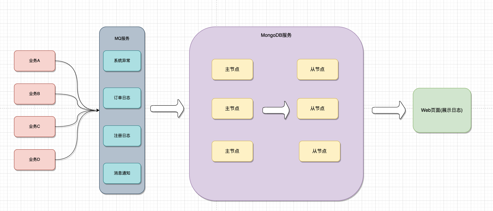
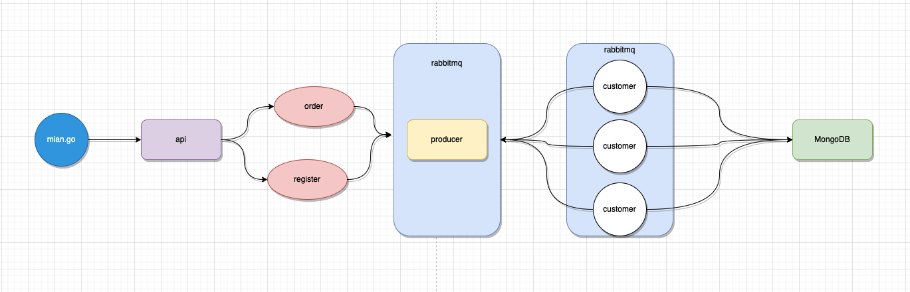
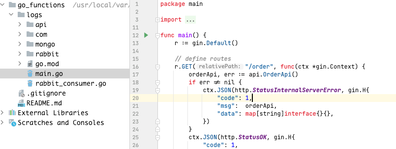
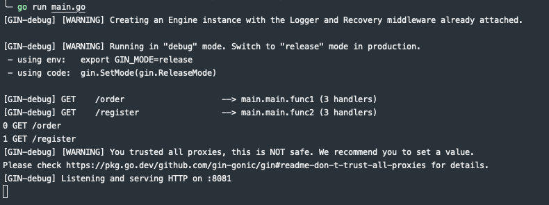
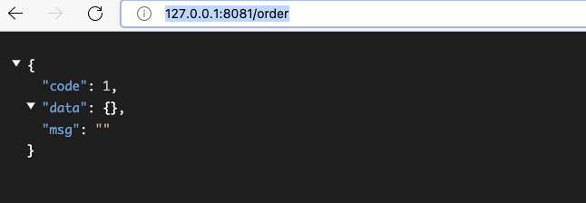
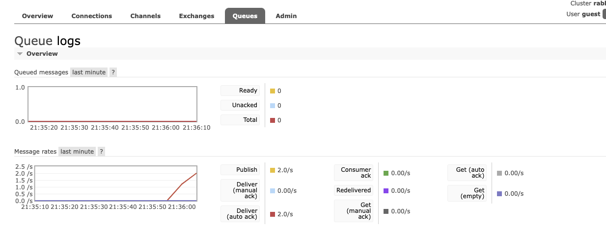
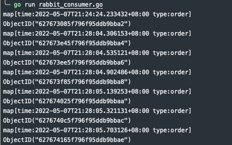

上一篇，我们针对分布式日志存储方案设计做了一个理论上的分析与总结，[文章地址](https://sourl.cn/6eGHPz)。本文我们将结合其中的一种方案进行实战代码的演示。另外一种方案，将在下一篇文章进行分享，此篇文章分享的是MongoDB架构模式。在知乎上发布该文章时，有人提到使用[opentelemtry+tsdb](https://zhuanlan.zhihu.com/p/509856830)，感兴趣的可以去了解一下。

## 架构模式

通过上一篇的分析，我们大致总结出这样的一个架构设计，架构图如下：

1. 业务A、业务B、业务C和业务D表示我们实际的接口地址。当客户端发送请求时，直接的处理模块。系统日志的生成也是在该模块中进行生成。
2. MQ服务，则是作为日志队列，临时存储日志消息。这样是为了提高日志的处理能力。在高并发的业务场景中，如果实时的将日志写入到MongoDB中，这样难免会降低业务处理的速度。
3. MongoDB服务，则是最终的日志落地。也就是说将我们的日志存储到磁盘，以达到数据的持久化，避免数据丢失。
4. 对于系统的日志查看，我们可以直接登录MongoDB服务进行SQL查询。一般为了效率、安全等原因，会提供一个管理界面来实时查看MongoDB的日志。这里就是我们的web展示界面。可以通过web界面对日志做查询、筛选、删除等操作。

上面提到的是一个架构的大致流程图。下面将具体的代码演示，需要查看代码的可以通过[Github仓库](https://github.com/7small7/go_functions)地址获取。

## 代码演示

代码中要操作RabbitMQ服务、MongoDB服务、API业务逻辑处理和其他的服务，我这里将代码调用逻辑设计为如下结构。

magin.go(入口文件)->api(业务处理)->rabbitmq(日志生产者、消费者)->MongoDB(日志持久化)。
整理代码架构如下：


### 代码说明

下面罗列几个使用到的技术栈以及对应的版本，可能需要在使用本代码时，需要注意一下这些服务的版本兼容，避免代码无法运行。
1. Go version 1.16。
2. RabbitMQ version 3.10.0。
3. MongoDB version v5.0.7。

下面对几个稍微重要的代码段，进行简单说明，完整代码直接查看[Github仓库](https://github.com/7small7/go_functions)即可。
#### 入口文件

```go
package main

import (
	"fmt"
	"net/http"

	"github.com/gin-gonic/gin"

	"gologs/api"
)

func main() {
	r := gin.Default()

	// 定义一个order-api的路由地址，并做对应的接口返回
	r.GET("/order", func(ctx *gin.Context) {
		orderApi, err := api.OrderApi()
		if err != nil {
			ctx.JSON(http.StatusInternalServerError, gin.H{
				"code": 1,
				"msg":  orderApi,
				"data": map[string]interface{}{},
			})
		}
		ctx.JSON(http.StatusOK, gin.H{
			"code": 1,
			"msg":  orderApi,
			"data": map[string]interface{}{},
		})
	})
	// 指定服务地址和端口号
	err := r.Run(":8081")
	if err != nil {
		fmt.Println("gin server fail, fail reason is ", err)
	}
}
```

#### 订单业务逻辑

```go
package api

import (
	"time"

	"gologs/rabbit"
)
// 订单业务逻辑处理，并调用Rabbit服务投递order日志
func OrderApi() (string, error) {
	orderMsg := make(map[string]interface{})
	orderMsg["time"] = time.Now()
	orderMsg["type"] = "order"
	err := rabbit.SendMessage(orderMsg)
	if err != nil {
		return "write rabbitmq log fail", err
	}
	return "", nil
}
```

#### RabbitMQ处理日志

```go
package rabbit

import (
	"encoding/json"

	"github.com/streadway/amqp"

	"gologs/com"
)

func SendMessage(msg map[string]interface{}) error {
	channel := Connection()
	declare, err := channel.QueueDeclare("logs", false, false, false, false, nil)
	if err != nil {
		com.FailOnError(err, "RabbitMQ declare queue fail!")
		return err
	}

	marshal, err := json.Marshal(msg)
	if err != nil {
		return err
	}
	err = channel.Publish(
		"",
		declare.Name,
		false,
		false,
		amqp.Publishing{
			ContentType:  "text/plain", // message type
			Body:         marshal,      // message body
			DeliveryMode: amqp.Persistent,
		})
	if err != nil {
		com.FailOnError(err, "rabbitmq send message fail!")
		return err
	}
	return nil
}
```

#### 消费者消费消息

```go
package rabbit

import (
	"encoding/json"
	"fmt"
	"time"

	"gologs/com"
	"gologs/mongo"
)

func ConsumerMessage() {
	channel := Connection()

	declare, err := channel.QueueDeclare("logs", false, false, false, false, nil)
	if err != nil {
		com.FailOnError(err, "queue declare fail")
	}

	consume, err := channel.Consume(
		declare.Name,
		"",
		true,
		false,
		false,
		false,
		nil,
	)
	if err != nil {
		com.FailOnError(err, "message consumer failt")
	}

	for d := range consume {
		msg := make(map[string]interface{})
		err := json.Unmarshal(d.Body, &msg)
		fmt.Println(msg)
		if err != nil {
			com.FailOnError(err, "json parse error")
		}
		one, err := mongo.InsertOne(msg["type"].(string), msg)
		if err != nil {
			com.FailOnError(err, "mongodb insert fail")
		}
		fmt.Println(one)
		time.Sleep(time.Second * 10)
	}
}
```

#### 调用MongoDB持久化日志

```go
package mongo

import (
	"context"
	"errors"

	"gologs/com"
)

func InsertOne(collectionName string, logs map[string]interface{}) (interface{}, error) {
	collection := Connection().Database("logs").Collection(collectionName)
	one, err := collection.InsertOne(context.TODO(), logs)

	if err != nil {
		com.FailOnError(err, "write mongodb log fail")
		return "", errors.New(err.Error())
	}

	return one.InsertedID, nil
}
```

## 实战演示

上面大致分享了代码逻辑，接下来演示代码的运行效果。

### 启动服务

启动服务，需要进入到log是目录下面，`main.go`就是实际的入口文件。


### 启动日志消费者

启动日志消费者，保证一旦有日志，消费者能把日志实时存储到MongoDB中。同样的需要到logs目录下执行该命令。
```go
go run rabbit_consumer.go
```

### 调用API服务

为了演示，这里直接使用浏览器去访问该order对应的接口地址。`http://127.0.0.1:8081/order`。接口返回如下信息：

> 如果code是1则表示接口成功，反之是不成功，需要在调用的时候注意一下。

这里可以多访问几次，查看RabbitMQ中的队列信息。如果消费者消费的比较慢，应该可以看到如下信息：


### 消费者监控

由于我们在启动服务时，就单独开启了一个消费者线程，这个线程正常情况下时一直作为后台程序在运行。我们可以查看大致的消费数据内容，如下图：


### MongoDB查看数据

RabbitMQ消费者将日志信息存储到MongoDB中，接下来直接通过MongoDB进行查询。
```mongodb
db.order.find();
[
  {
    "_id": {"$oid": "627675df5f796f95ddb9bbf4"},
    "time": "2022-05-07T21:36:02.374928+08:00",
    "type": "order"
  },
  {
    "_id": {"$oid": "627675e95f796f95ddb9bbf6"},
    "time": "2022-05-07T21:36:02.576065+08:00",
    "type": "order"
  }
  ................
]
```

## 文末总结

对于该架构的总体演示，就到此结束。当然还有很多细节需要完善，此篇内容主要是分享一个大致的流程。下一篇我们将分享如何在Linux上大家ELK环境，以便我们后期做实际代码演示。
