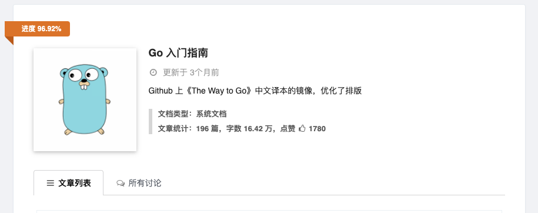
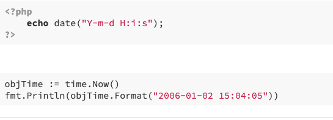
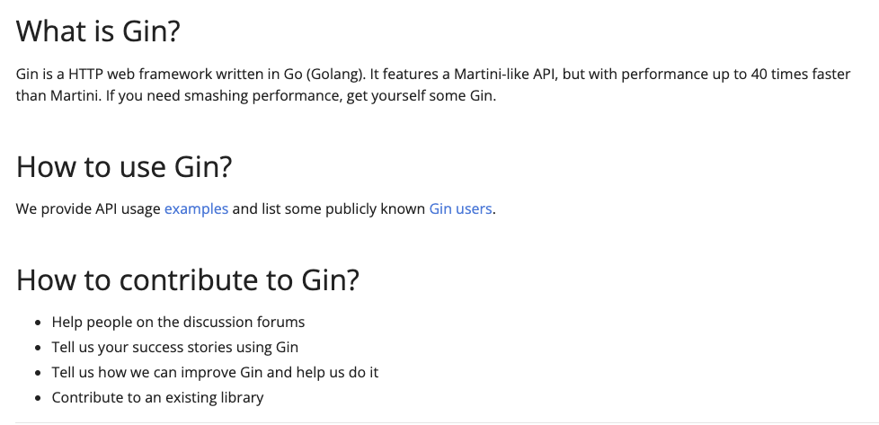
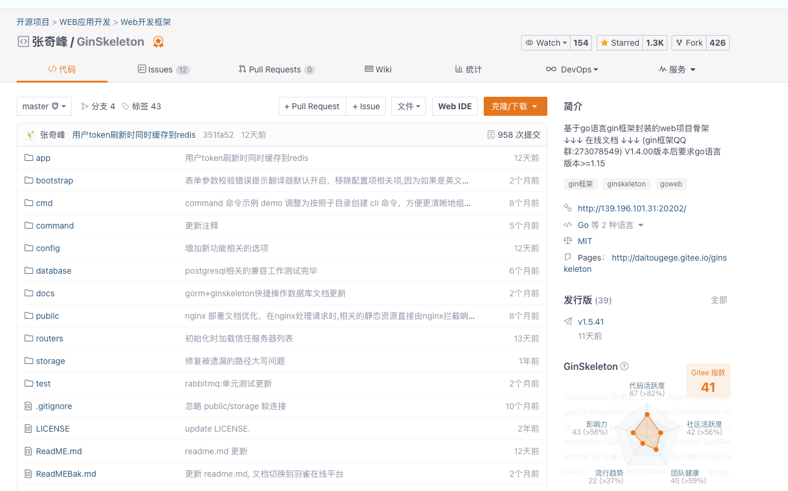
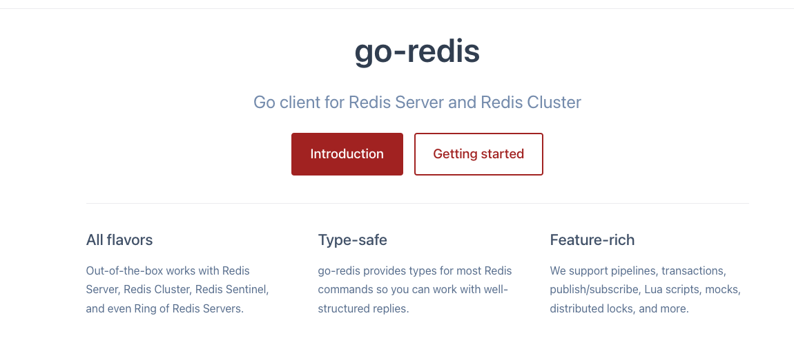
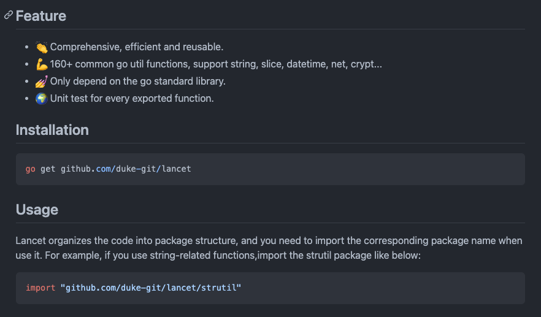

## 说明
go语言做我新的一门后端语言，最近两年在也是在飞速的发展。现在很多公司招聘，也开始招聘go开发者。很多做Java、PHP的开发者都已经转向go语言开发。

go语言入门的成本是非常低的，语法简单。有编程基础的人，基本一周时间就能写一些简单项目了。但是想深入还是需要项目、时间的磨炼。总结一些个人在转向go开发中发现一些不错的资源。

## 基础学习
go语言的语法是非常简单的，对应有开发基础的人来说，也就几天的时间。如果你想快速入门go，推荐你认真看完下面的书籍。看完并针对每一章节做一些习题练习，基本来说你已经熟练的掌握好go的基础知识了。网站地址：https://learnku.com/docs/the-way-to-go

## php2golang
如果你是一名PHP开发者，刚转入go不久，对go中的包使用还不够熟练。例如，你知道在PHP中使用date函数获取当前时间，在go中不知道怎么实现，直接在网站搜索date函数，就可以得到下面的结果。直接复制代码，就可以运用到你的项目中。网站地址：https://php2golang.com/

## 框架
做PHP的开发者，一般都是做web类的项目。如果你刚开始转go，特别推荐去学习一下gin。它是一个适合做web应用的框架。包含了web开发常用的一些功能，中间件、路由、多语言、session、cookie、request与response等相关的功能。网站地址：https://gin-gonic.com/docs/

对于刚开始写go的你，或许不知道怎么去定义项目的目录结构。你可以去了解一下，下面这个框架，是用gin框架封装的。包含了基本的目录结构，以及常用的库、请求、响应以及中间件的处理等相关的功能。

这是一个基于go语言gin框架的web项目骨架，专注于前后端分离的业务场景,其目的主要在于将web项目主线逻辑梳理清晰，最基础的东西封装完善，开发者更多关注属于自己的的业务即可。网站地址：https://gitee.com/daitougege/GinSkeleton

## 组件
### Redis
如今的项目，不管项目的大小，几乎都会用到Redis。利用go开发项目，当然也不例外。你可以使用下面这个Redis库，包含Redis基本的操作、主从、哨兵和集群等等功能。
网站地址：https://redis.uptrace.dev/

### 函数库
在PHP中，有很多强大的函数库，这让我们处理数据非常得心应手。当然在go中也有很多，刚开始的你，可能不知道怎么用。下面推荐的这个库，包含了我们常用的函数操作。例如字符串、数组、切片、文件、加密和时间等想关方面，都给你封装好了，直接调用就可以了。同时你要去学习疯长的方式，也非常的简单。网站地址：https://github.com/duke-git/lancet

