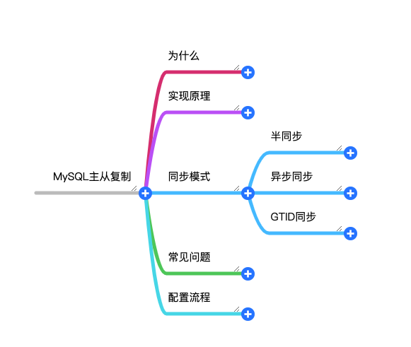
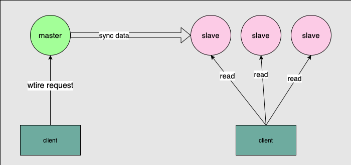
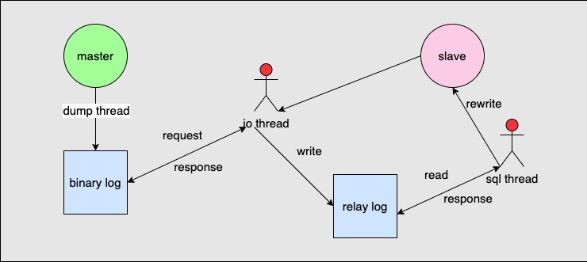
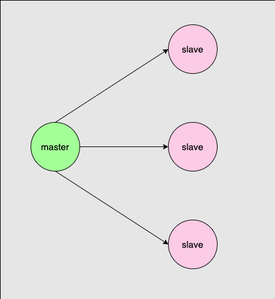
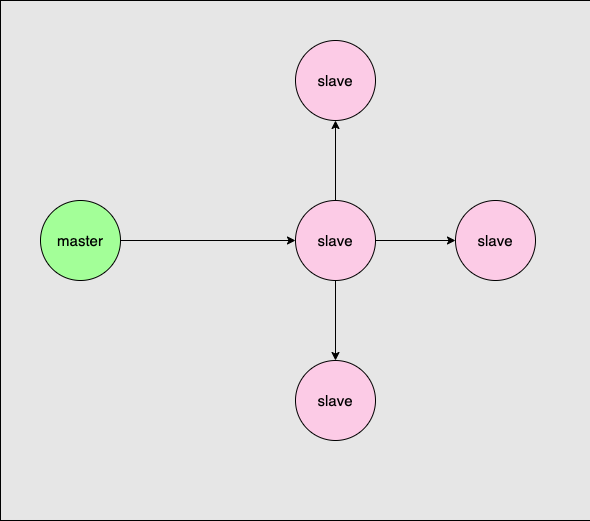
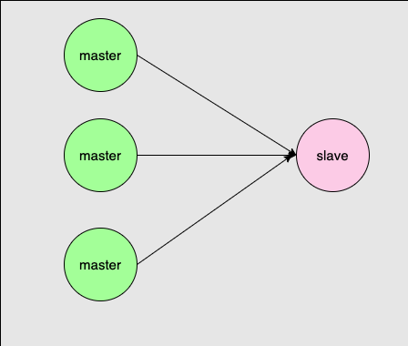
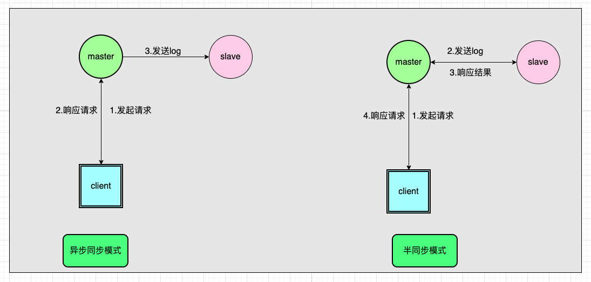
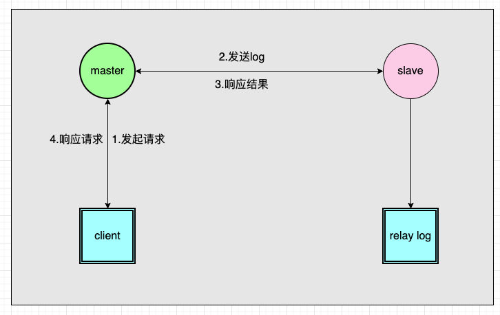

[TOC]

## 文章简介

网络上关于 MySQL 主从复制的文章很多都是讲解如何实现，以及部分实现原理，缺乏对 MySQL 主从复制的全面介绍。例如主从复制的模式(半同步模式和异步同步模式)、同步的原理(binary log+position，GTID)、主从复制的常见问题都缺乏一个全面的总结。

本文针对这些部分内容做一个全面的分析与总结。本文主要的内容有 MySQL**主从复制的原因、实现原理、实现步骤、半同步模式、异步同步模式、GTID 同步、常见问题与解决方案**等内容。



## 模式优势

在了解主从复制之前，我们先了解一下什么是主从复制。说的简单一点就是将一台 MySQL 服务器的数据库文件同步到其他的 MySQL 服务上，使得被同步的 MySQL 服务也能读取到我们的数据。

为什么会有主从复制呢？这里我总结了两点原因：

1. 数据容灾、备份。当我们的数据库只使用一台服务时，如果我们的数据库遭到破坏，例如黑客的攻击、人为操作的失误等等情况。这时候我们就可以在一定程度上**保障我们数据库的恢复**。

如果只为为了防止数据库的丢失，我们可以针对数据进行定时备份，为何还要搞什么主从复制，这样不是更麻烦嘛。如果我们只是定时备份数据库，可以试想一下，万一在某个备份操作还未执行的阶段，数据库出现问题，中间的这一部分数据不就没法恢复了嘛。

2. 缓解 MySQL 主服务的压力。当我们线上应用用户量小的时候，所有的读与写操作都在一台服务器上，这时候还不会遇到什么问题。当用户量逐渐增加，访问数据库的请求也越来越多，这时候就给 MySQL 服务器增加了负担，容易导致服务崩溃等问题。因此，**主从复制模式可以缓解单服务器的压力，将写操作给主服务器，读操作给从服务器，从服务器可以部署多台，分摊压力。因为在一个应用中，读的操作肯定是大于写的操作**。



## 实现原理

下图是 MySQL 主从复制的一个原理图：



1. master 服务器会将 SQL 记录通过多 dump 线程写入到 binary log 中。

2. slave 服务器开启一个 io thread 线程向服务器发送请求，向 master 服务器请求 binary log。master 服务器在接收到请求之后，根据偏移量将新的 binary log 发送给 slave 服务器。

3. slave 服务器收到新的 binary log 之后，写入到自身的 relay log 中，这就是所谓的中继日志。

4. slave 服务器，单独开启一个 sql thread 读取 relay log 之后，写入到自身数据中。

## 常见模式

常见的主从模式有如下几种，具体的模式也得看实际的业务需要。根据实际的情况，选择合适的一种架构模式。

1. 一主一从模式。

2. 一主多从模式。

3. 级联主从模式。

4. 一主多从模式。


## 配置流程

在本文演示中，采用一主一从的架构模式。

| 角色   | IP 地址       | 端口号 | server-id |
| ------ | ------------- | ------ | --------- |
| master | 192.168.0.112 | 3304   | 1         |
| slave  | 192.168.0.112 | 3305   | 2         |

要开启主从复制，首先要遵循下面几种条件。

1. master 和 server 都要有自身的 server-id，并且每一个 server-id 不能相同。

2. master 开启 log_bin 选项。推荐将从服务器的该选项也开启。

3. master 开启 binlog_format=row 选项。推荐从服务器也开启该选项，并且 log_slave_updates 也逐步开启，后期如果 slave 升级为 master 也方便扩展。

### master 操作

将下面的一段配置添加到 master 配置文件中，重启服务让配置生效。

```mysql
server_id               = 1
log_bin                 = mysql-bin
binlog_format           = ROW
```

接下来登录到 master 命令行操作界面，创建一个主从复制的账号。这里创建一个账号为 slave_user，密码为 123456 的账号。

```mysql
grant replication slave on *.* to 'slave_user'@'%' identified by '123456';
flush privileges;
```

查看 master 的 binary log 文件和 postion。记录下来待会在 slave 上设置主节点信息时需要使用。

```mysql
mysql root@127.0.0.1:(none)> show master status;
+------------------+----------+--------------+------------------+-------------------+
| File             | Position | Binlog_Do_DB | Binlog_Ignore_DB | Executed_Gtid_Set |
+------------------+----------+--------------+------------------+-------------------+
| mysql-bin.000062 | 728      |              |                  |                   |
+------------------+----------+--------------+------------------+-------------------+
1 row in set
Time: 0.011s
```

### slave 操作
将下面的配置项添加到 slave 配置文件中，重启服务让配置生效。
```mysql
server_id               = 2
log_bin                 = mysql-bin
binlog_format           = ROW
log_slave_updates		= ON
read_only				= ON
super_read_only			= ON
```
接下来登录到 slave 命令行操作界面，设置主节点信息。
```mysql
change master to master_host='192.168.0.112',master_port=3304,master_user='slave_user',master_password='123456',master_log_file='mysql-bin.000062',master_log_pos=728;
start slave;
stop slave;
```

1. master_host：master 的 IP 地址。

2. master_port：master 的服务端口。

3. master_user：master 创建的主从复制用户。

4. master_password：master 创建的主从复制用户密码。

5. master_log_file：master 的 binary log 文件(上面在 master 上执行 `show master status`获取到的 File 值)。

6. master_log_pos：master 的复制偏移量(上面在 master 上执行 `show master status`获取到的 Position 值)。

> 配置主节点的信息之后，还不能进行主从复制，还需要我们开启主从复制。

### 开启主从复制

```mysql
start slave;
```

### 断开主从复制

```mysql
stop slave;
```

### 重置主从复制信息

```mysql
reset slave all;
```

## 效果演示

在配置之前，在 master 上实现有这样一张表，表结构如下：

```mysql
CREATE TABLE `mysql_test`.`master_slave_demo`  (
  `id` int(10) UNSIGNED ZEROFILL NOT NULL AUTO_INCREMENT,
  `name` varchar(255) CHARACTER SET utf8mb4 COLLATE utf8mb4_general_ci NOT NULL,
  PRIMARY KEY (`id`) USING BTREE
) ENGINE = InnoDB AUTO_INCREMENT = 10 CHARACTER SET = utf8mb4 COLLATE = utf8mb4_general_ci ROW_FORMAT = Dynamic;
```

在配置主从复制之前，我们在从服务器上也同样创建一张这样的表，库名和表名与 master 保持一致。

假设你都做好了这些工作，此时我们在 master 上 insert 一条数据，然后去 slave 查看是否有新的数据。

```mysql
mysql root@127.0.0.1:mysql_test> insert into `master_slave_demo` (`name`) value ('FFFFFF');
Query OK, 1 row affected
Time: 0.016s
mysql root@127.0.0.1:mysql_test> select * from `master_slave_demo`;
+----+--------+
| id | name   |
+----+--------+
| 1  | 张三   |
| 2  | 李四   |
| 3  | 王五   |
| 4  | 赵六   |
| 5  | AA     |
| 6  | BB     |
| 7  | CC     |
| 8  | DD     |
| 9  | EE     |
| 10 | FFFFFF |
+----+--------+
10 rows in set
Time: 0.011s
```

此时登录到 slave 查看是否有新的数据。

```mysql
mysql root@127.0.0.1:mysql_test> select * from master_slave_demo;
+----+--------+
| id | name   |
+----+--------+
| 1  | 张三   |
| 2  | 李四   |
| 3  | 王五   |
| 4  | 赵六   |
| 7  | CC     |
| 8  | DD     |
| 9  | EE     |
| 10 | FFFFFF |
+----+--------+
8 rows in set
Time: 0.013s
```

此时发现我们的数据已经自动同步过来了，到此我们的主从复制也配置完成了。

> 对于主从复制的数据库表不推荐使用该方式，在实际的过程中会遇到各种问题。这里只是为了文章演示采用的一种模式，后面针对 MySQL 的数据备份会单独总结一下如何正确的去操作。

## 同步模式

上面总结了同步的原理、同步的配置流程和同步的实际效果，下面针对主从复制的同步模式进行深一步的探索。为什么会有不同的同步模式呢？这肯定是因为某种模式存在缺陷，默认的同步模式使用的是异步同步模式，在下面的示例中，我们就不在演示了，直接演示半同步模式。

### 同步模式分类

同步模式主要分为异步同步和半同步模式(还有一种 GTID 模式，就单独做讲解，因为它不是基于这种 binary + Log 的简单形式)，两者实现的方式如下图：



### 异步同步模式

异步同步模式是 MySQL 默认的同步策略模式。客户端在向服务端发送请求后，master 处理完之后，直接返回客户端结果，接着在将对应的 log 信息发送给 slave 节点。

上面的演示步骤就是属于异步同步模式，因此这里不做再次演示。

### 半同步模式

半同步模式与异步同步的模式最大的区别在于

1. master 处理完自身操作，将对应的 binary log 发送给从服务器，从服务器通过 io thread 写入到 relay log 中，然后将结果返回给 master，master 在收到 salve 的响应之后在返回给客户端。

2. 半同步模式也是基于异步复制的基础上进行的，无非是半同步模式需要安装异步插件完成。

半同步模式具体操作流程：



### 半同步实现流程

1. 检测是否支持动态安装插件模式。

```mysql
mysql root@127.0.0.1:(none)> select @@have_dynamic_loading
+------------------------+
| @@have_dynamic_loading |
+------------------------+
| YES                    |
+------------------------+
1 row in set
Time: 0.016s
```

2. 在 master 上安装 master 对应的插件，也不一定只安装 master 对应的插件，slave 的插件也可以安装，后期服务的升级和降级也可以直接使用。

```mysql
mysql root@127.0.0.1:(none)> INSTALL PLUGIN rpl_semi_sync_master SONAME 'semisync_master.so';
Query OK, 0 rows affected
Time: 0.015s
mysql root@127.0.0.1:(none)> show global variables like 'rpl_semi%';
+-------------------------------------------+------------+
| Variable_name                             | Value      |
+-------------------------------------------+------------+
| rpl_semi_sync_master_enabled              | OFF        |
| rpl_semi_sync_master_timeout              | 10000      |
| rpl_semi_sync_master_trace_level          | 32         |
| rpl_semi_sync_master_wait_for_slave_count | 1          |
| rpl_semi_sync_master_wait_no_slave        | ON         |
| rpl_semi_sync_master_wait_point           | AFTER_SYNC |
+-------------------------------------------+------------+
6 rows in set
Time: 0.015s
```

3. 在 slave 安装 slave 对应的插件，同理也可以安装 master 对应的插件。

```mysql
mysql root@127.0.0.1:(none)> INSTALL PLUGIN rpl_semi_sync_slave SONAME 'semisync_slave.so';
Query OK, 0 rows affected
Time: 0.006s
mysql root@127.0.0.1:(none)> show global variables like 'rpl_semi%';
+-------------------------------------------+------------+
| Variable_name                             | Value      |
+-------------------------------------------+------------+
| rpl_semi_sync_master_enabled              | OFF        |
| rpl_semi_sync_master_timeout              | 10000      |
| rpl_semi_sync_master_trace_level          | 32         |
| rpl_semi_sync_master_wait_for_slave_count | 1          |
| rpl_semi_sync_master_wait_no_slave        | ON         |
| rpl_semi_sync_master_wait_point           | AFTER_SYNC |
| rpl_semi_sync_slave_enabled               | OFF        |
| rpl_semi_sync_slave_trace_level           | 32         |
+-------------------------------------------+------------+
8 rows in set
Time: 0.012s
```

4. master 服务器和 slave 服务器都开启主从复制插件功能。

```mysql
mysql root@127.0.0.1:(none)> set global rpl_semi_sync_master_enabled=ON;
Query OK, 0 rows affected
Time: 0.004s
mysql root@127.0.0.1:(none)> set global rpl_semi_sync_slave_enabled=ON;
Query OK, 0 rows affected
Time: 0.002s
mysql root@127.0.0.1:(none)> show global variables like 'rpl_semi%';
+-------------------------------------------+------------+
| Variable_name                             | Value      |
+-------------------------------------------+------------+
| rpl_semi_sync_master_enabled              | ON         |
| rpl_semi_sync_master_timeout              | 10000      |
| rpl_semi_sync_master_trace_level          | 32         |
| rpl_semi_sync_master_wait_for_slave_count | 1          |
| rpl_semi_sync_master_wait_no_slave        | ON         |
| rpl_semi_sync_master_wait_point           | AFTER_SYNC |
| rpl_semi_sync_slave_enabled               | ON         |
| rpl_semi_sync_slave_trace_level           | 32         |
+-------------------------------------------+------------+
8 rows in set
Time: 0.013s
```

5. salve 节点半同步复制模式。

```mysql
stop slave io_thread;
start slave io_thread;
```

> 在该步骤中，省略了配置主从关系的一步，因为上面在演示主从复制时，已经建立了一个主从复制关系了并且半同步模式也是基于异步同步模式进行的，所以你只需按照上面主从复制操作的流程进行即可。

6. 在 master 上查看 slave 信息。

```mysql
mysql root@127.0.0.1:(none)> show global status like '%semi%';
+--------------------------------------------+-------+
| Variable_name                              | Value |
+--------------------------------------------+-------+
| Rpl_semi_sync_master_clients               | 1     |
| Rpl_semi_sync_master_status                | ON    |
+--------------------------------------------+-------+
15 rows in set
Time: 0.011s
```

> 这里我们看到 Rpl_semi_sync_master_clients=1，则表示有一个 salve 节点连接上了。

7. 检测结果

通过上面的配置，半同步模式已经完成了。你可以直接在 master 上操作数据，slave 节点就能正常同步数据了。

### 半同步问题总结

1. slave 节点响应 master 延迟。

当 master 发送给 slave 节点 binary log 之后，需要等待 slave 的响应。有时可能 slave 节点响应很慢，master 不能一直等待，这样会导致客户端请求超时情况，可以通过下面的参数进行设置。
该参数的单位是毫秒，默认是 10 秒，推荐设置大一点。因为超时之后，master 会自动切换为异步复制。

```mysql
rpl_semi_sync_master_timeout
```

2. 半同步模式自动转为异步同步模式。

当面 1 中提到了，如果超时之后，半同步模式会自动切换为异步复制模式。因此设置该参数即可。

3. master 接收 slave 节点数量，响应客户端。

当 master 需要将 binary log 发送给多个 slave 节点时，如果 slave 节点存在多个，master 都要等待 slave 一一响应之后才回复客户端，这也是一个特别耗时的过程，可以通过下面的参数进行设置。
该参数的意义就是，只要 master 接收到 n 个 slave 的响应之后，就可以返回给客户端了。默认是 1。

```mysql
rpl_semi_sync_master_wait_for_slave_count
```

4. 当半同步模式自动切换为异步之后，如何切换为半同步模式。

这时候需要手动切换模式。就是关闭 io_thread，再开启 io_thread。

```mysql
start slave io_thread;
```

### 半同步一致性

半同步复制模式极大程度上提高了主从复制的一致性。同时在 MySQL5.7+的版本增加了另外一个参数，让复制的一致性更加可靠。这个参数就是`rpl_semi_sync_master_wait_point`，需要在 master 上执行。

```mysql
set global rpl_semi_sync_master_wait_point = 'x';
```

该参数有两个值。一个值是 AFTER_SYNC，一个值是 AFTER_COMMIT。默认是 AFTER_SYNC。

1. AFTER_SYNC

master 在将事务写入 binary log 之后，然后发送给 slave。同时也会自动提交 master 的事务。等 slave 响应之后，master 接着响应给客户端信息。

2. AFTER_SYNC

master 在将事务写入 binary log 之后，然后发送给 slave。等待 slave 响应之后，才会提交 master 的事务，接着响应给客户端信息。

### 两者对比

1. 异步同步模式，是直接返回给客户端在处理 slave 的问题，如果 master 响应给客户端成功信息，在处理 slave 问题时，服务挂掉了，此时就会出现数据不一致。

2. 半同步模式，需要等待 slave 节点做出响应，master 才会响应客户端，如果 salve 响应较慢就会造成客户端等待时间较长。

3. 半同步模式，master 等待 slave 响应之后才会响应给客户端，此方式极大程度的保证了数据的一致性，为主从复制的数据一致性提供了更可靠的保证。也推荐使用该方式进行主从复制操作。

## GTID同步

### 什么是GTID同步

GTID是一种全局事务ID，它是在master上已经提交的事务，slave直接根据该ID进行复制操作。该操作替代了binary log + postion的方式。使得主从复制的配置操作更加简单。
> 该模式需要MySQL>=5.6版本。

### GTID组成部分

GTID = server-id + transaction-id组成。server-id不是MySQL配置文件中id，而是每一个MySQL服务在启动时，都会生成一个全局随机唯一的ID。transaction-id则是事务的ID，创建事务是会自动生成一个ID。

### 配置流程

1. master的配置文件增加如下配置。

```mysql
server_id               = 1
log_bin                 = ON
binlog_format           = ROW
gtid_mode				= ON
enforce_gtid_consistency = ON
```

2. slave的配置文件增加如下配置。

```mysql
server_id               = 2
log_bin                 = mysql-bin
binlog_format           = ROW
gtid_mode				= ON
enforce_gtid_consistency = ON
log_slave_updates		= ON
```

3. 配置好之后，一定记得重启master和salve服务。重启好之后，登录master，使用`show master status;`查看一下GTID。会看到如下的信息。

```mysql
mysql root@127.0.0.1:(none)> show master status;
+-----------+----------+--------------+------------------+------------------------------------------+
| File      | Position | Binlog_Do_DB | Binlog_Ignore_DB | Executed_Gtid_Set                        |
+-----------+----------+--------------+------------------+------------------------------------------+
| ON.000005 | 729      |              |                  | a9cf78c4-257f-11eb-94e0-0242ac120007:1-2 |
+-----------+----------+--------------+------------------+------------------------------------------+
1 row in set
Time: 0.011s
```

4. slave服务建立连接关系。下面的操作都是在slave节点进行。

```mysql
# 重置所有的复制关系。
mysql root@127.0.0.1:(none)> reset slave all;
Query OK, 0 rows affected
Time: 0.056s


# 查看主从复制状态，发现没有任何信息了，则表示重置成功了。
mysql root@127.0.0.1:(none)> show slave status\G;
0 rows in set
Time: 0.005s


# 设置master信息。
change master to master_host='192.168.0.112',master_port=3304,master_user='slave_user',master_password='123456',master_auto_position=1;
Query OK, 0 rows affected
Time: 0.048s


# 启动复制。
start slave;
mysql root@127.0.0.1:(none)> start slave;
Query OK, 0 rows affected
Time: 0.007s


# 查看复制状态。
mysql root@127.0.0.1:(none)> stop slave io_thread;
***************************[ 1. row ]***************************
Slave_IO_State                | Waiting for master to send event
Master_Host                   | 192.168.0.112
Master_User                   | slave_user
Master_Port                   | 3304
Connect_Retry                 | 60
Master_Log_File               | ON.000005
Read_Master_Log_Pos           | 729
Relay_Log_File                | aa7863c59748-relay-bin.000002
Relay_Log_Pos                 | 928
Relay_Master_Log_File         | ON.000005
Slave_IO_Running              | Yes
Slave_SQL_Running             | Yes
Replicate_Do_DB               |
..........
```

5. 需要测试结果，可以直接在master插入数据，看slave数据是否已经发生变化。

## 文章总结

通过上面的演示，你已经基本掌握了主从复制的原理、配置流程。针对主从复制还有很多细节，由于篇幅问题后期会持续更新。

> 专注于PHP、MySQL、Linux和前端开发，感兴趣的感谢点个关注哟！！！文章整理在[GitHub](https://github.com/bruceqiq/code_study),主要包含的技术有PHP、Redis、MySQL、JavaScript、HTML&CSS、Linux、Java、Golang、Linux和工具资源等相关理论知识、面试题和实战内容。
