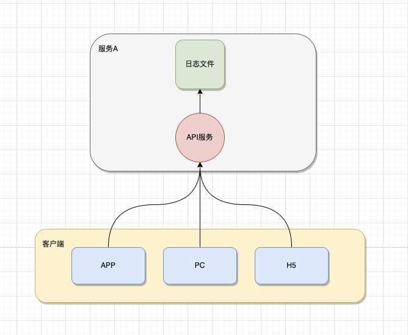
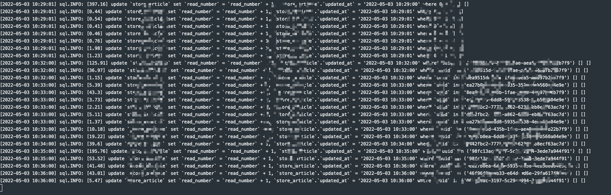
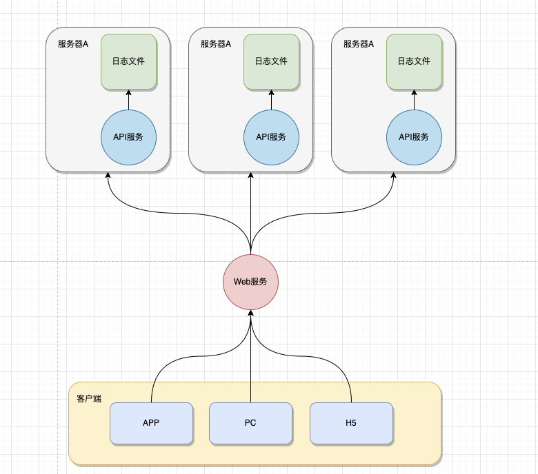
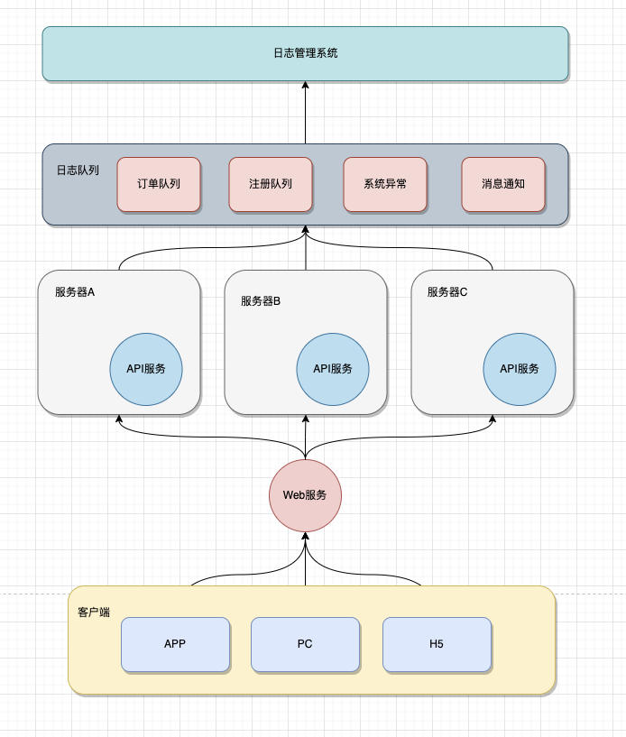
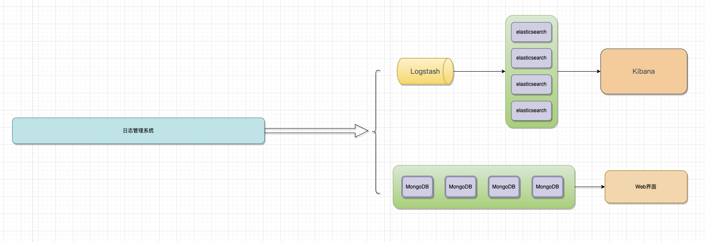
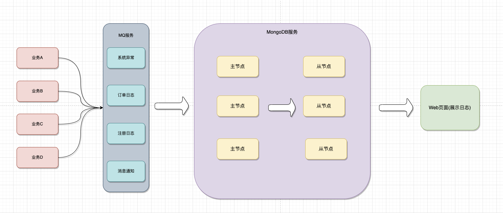
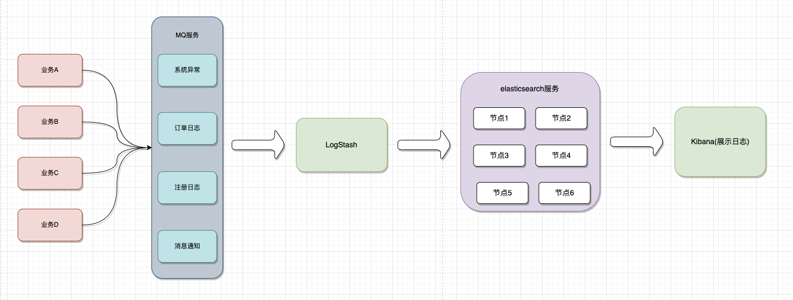

在一个完整的项目中，不仅仅是要完成正常的业务开发。同时为了提高一些开发效率、系统异常的追踪、系统功能的扩展等等因素，往往会用到系统在开发、运行过程中所产生的日志。这就需要我们有一个完善的日志系统来存储这些数据。本文将分享如何设计一个高可用、可扩展的分布式日志系统。
1. 本文是一种理论性的方案探索，当然各种方案也是在实际的生产环境中经过实践总结而来的。
2. 本文是分布式日志存储系列的理论篇。也有实战篇，将会分享从0到1的整个过程，从0环境的搭建到真正的实践落地。文章会定期的完善，[最终文章地址](https://gitee.com/bruce_qiq/code_study/blob/main/%E9%AB%98%E5%B9%B6%E5%8F%91%E6%9E%B6%E6%9E%84%E8%AE%BE%E8%AE%A1%E5%AE%9E%E6%88%98%E6%80%BB%E7%BB%93/%E5%88%86%E5%B8%83%E5%BC%8F%E6%97%A5%E5%BF%97%E5%AD%98%E5%82%A8%E6%96%B9%E6%A1%88%E8%AE%BE%E8%AE%A1.md)。

## 日志的重要性

在一个系统中，日志常常在下面的一些场景中占着非常大的作用：
1. 项目开发阶段的调试、线上服务异常排查。
2. 系统异常的监控。
3. 系统数据分析。

对应日志，主要分为下面三大类型：

## 日志服务的演进

通过上面几点，大致明白了一个日志系统的重要性。接下来，我们将进一步了解如何设计一个日志系统。
### 单节点部署

在项目早期，由于项目`用户量小`、`业务数据少`等特点，一般项目都会采用单节点的方式进行部署。此时的日志，一般会以文件的方式存储在对应服务器上。如下图：

当客户端向服务端发送请求，对应的服务器处理业务并将日志记录到日志文件中。这也是传统的日志记录方式，很多的后端框架默认的日志记录方式也如此。如下面PHP的Hyperf框架，默认将MySQL的操作日志记录到日志文件中。

#### 优点

按照这种传统的单节点部署，有什么好处呢？
1. 系统架构单一、部署简单。不用担心各种服务之间调用问题。
2. 技术成本低、易维护。直接使用开发语言的文件操作函数，写人即可。
3. 性能高、稳定。不需要调用其他的服务组件，直接调用系统接口写入磁盘即可。

#### 缺点
1. 当日志文件过大时，需要对日志文件做切割，避免写入性能降低。
2. 不便于日志排查。对应开发人员来说，可以直接分析日志内容。如果对于非开发人员来说，对日志存储的就有一定的要求。
3. 存在安全问题。对应服务器一般都有设置权限，需要对服务器用户设置严格的权限。

### 分布式部署(文件)

这里的分布式部署(文件)指的是，系统服务采用分布式部署时，日志存储还是采用文件存储。大致的逻辑图如下：

#### 优点
1. 这样的部署方案有什么好处，和上面提到的单节点部署一样。

#### 缺点
1. 在分布式部署中，还是同样的会遇到单节点部署所遇到的问题。
2. 不便于系统排查。当系统出现异常时，由于是分布式部署，我们不知道最终的日志存储在那一台服务器上，就需要挨个服务器的排查。降低了问题排查效率。

### 分布式部署(日志系统)

上面提到了分布式系统，使用文件存储日志的几个弊端。因此这里推出使用独立的日志系统，存储系统日志。大致逻辑图如下：

1. 当客户单发送请求到服务器，服务器处理对应的业务逻辑和记录日志服务。
2. 为了提高系统的响应速度、高可用，在记录日志时，先将日志写入到MQ消息队列中，开启独立的线程将队列中的日志写入到磁盘中。常见的MQ消息队列有，RabbitMQ，RocketMQ，ActiveMQ，ZeroMQ，Kafka，IBM WebSphere等。可以根据系统的实际需要选择合适的MQ服务。
3. 写入对应的日志系统之后，可以独立开发一套系统，来做日志的显示、查询、删除等操作。

#### 优点
1. 解决了分布式部署中采用文件存储的弊端。
2. 提高了系统的可用性。在写日志时，开发人员只需要将日志写入到对应的MQ消息队列中即可。做持久化直接让单独的线程执行。
3. 提高了系统的扩展性。如果团队中，其他的项目需要增加日志功能，我们不需要单独的增加服务器，直接写入原有的MQ消息队列系统即可。

#### 缺点
1. 系统部署复杂。增加了MQ服务，也意味着在项目前期增加了运维成本。
2. 对开发人员要求高。需要熟悉MQ消息服务技术栈。
3. 系统架构要求高。在项目前期一定要搭建一个高可用、高扩展的架构，当业务变得越来越复杂时以及各种服务之间的调用，影响正常的业务逻辑。

## 日志系统

上面针对日志服务做了一个架构演进的总结。接下来，就来具体的探讨如何设计一个高可用、高扩展的日志系统。
对应日志系统，我个人如下几个观点：
1. 可用性强，不能影响正常业务的执行。日志的作用最大的意义在于我们排查问题、分析问题以及解决问题。要保证在这个过程中，即使日志服务不可用的状态下，仍然不能影响到正常业务的日志。
2. 扩展性强。在设计日志系统时，不能只针对当前的系统做设计，还需要考虑到后期其他项目日志的接入。

针对日志系统，我们可以采用自研的方式，也可以采用开源系统部署。在本文总，分享两种较为简单的日志服务系统。大致的逻辑图如下：

### MongoDB存储

系统日志最终的落地，肯定是磁盘。因此，第一种方案我们使用MongoDB来记录日志。
为什么采用MongoDB作为日志存储服务器呢？
1. MongoDB严格来说是一个非关系型的数据库系统。它支持的数据结构非常松散，类似json格式的bson格式，因此可以存储比较复杂的数据类型。如果采用MySQL、SQLserver、oracle这样的具有严格数据结构要求的数据库，在日志统计纬度变化时，对应的数据表结构也会随着变化。
2. 查询效率高。MongoDB最大的特点是它支持的查询语言非常强大，其语法有点类似于面向对象的查询语言，几乎可以实现类似关系数据库单表查询的绝大部分功能，而且还支持对数据建立索引。
3. 业务拆分、提高业务数据库性能。如果把日志也存储在MySQL中，必然会降低MySQL的高并发性能问题。一个系统中，日志内容肯定非常的多，日志的读写抢占了对应的操作必然是会降低业务读写的操作。

使用MongoDB作为日志存储服务，大致的逻辑可以采用如下结构：

1. 业务系统处理日志，再调用MQ消息服务，先将日志数据存在MQ消息服务中。
2. 开启异步线程，将MQ服务的消息同步到MongoDB服务中，以达到持久化的目的。
3. Web页面则是用于日志数据的展示。

### ELK存储

​ ELK是Elasticsearch + Logstash + Kibana 这种架构的简写。​ 这是一种开源日志分析平台的架构。ELK是开源的，社区活跃，用户众多，这样的架构也得到广泛的使用。大致的逻辑图如下：
​ 
 
#### ELK常用架构

1. Elasticsearch + Logstash + Kibana
这是一种最简单的架构。这种架构，通过logstash收集日志，Elasticsearch分析日志，然后在Kibana(web界面)中展示。这种架构虽然是官网介绍里的方式，但是往往在生产中很少使用。

2. Elasticsearch + Logstash + filebeat + Kibana
与上一种架构相比，这种架构增加了一个filebeat模块。filebeat是一个轻量的日志收集代理，用来部署在客户端，优势是消耗非常少的资源(较logstash)， 所以生产中，往往会采取这种架构方式，但是这种架构有一个缺点，当logstash出现故障， 会造成日志的丢失。

1. Elasticsearch + Logstash + filebeat + redis(也可以是其他中间件，比如kafka（集群化）) + Kibana这种架构是上面那个架构的完善版，通过增加中间件，来避免数据的丢失。当Logstash出现故障，日志还是存在中间件中，当Logstash再次启动，则会读取中间件中积压的日志。目前我司使用的就是这种架构，我个人也比较推荐这种方式。

## 总结

1. 对于上面提高的几种方案，在实际过程中，还需要结合自身的项目情况，选择合适的架构，而不是为了追求技术的复杂度而忽略了自身的实际情况。

2. 关于分布式日志的理论在这里就介绍结束了，接下来的内容将实战演示分布式日志设计方案。感兴趣的可以持续关注。对于文章提到的方案，存在不足的地方，也欢迎大家指教。

